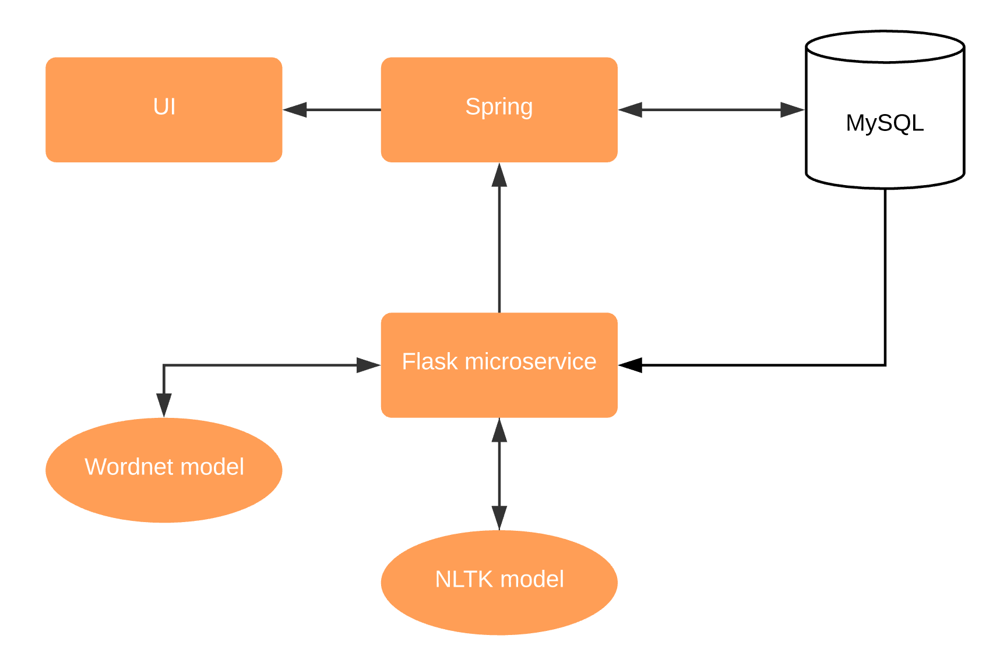

# Where Next?

A web app for surfacing relevant volunteer events from a freeform text query.

## Problem

People spend time searching for volunteer events instead of actually making an impact. Our aim is to minimize the time wasted in that process and get volunteers to the next opportunity faster.

## Deploy

Set up mysql.

```
brew install mysql
brew services start mysql
```

Install Python dependencies from requirements.text
Run the Python Flask app
https://flask.palletsprojects.com/en/1.0.x/tutorial/factory/
Flask app repo
https://github.com/Nov05/flask-event-finder

Then build and run the Spring webapp.

```
# in where-next/where-next-app
mvn clean install
cd target
java -jar where-next.jar
```

## Architecture

Spring webapp connected to a flask microservice



## Extensions

Improvements to NLP algorithm

For more data, include a big data store (e.g. HDFS) along with a document indexer (e.g. Solr) to process new volunteer events as they come in to enable fast text search.

